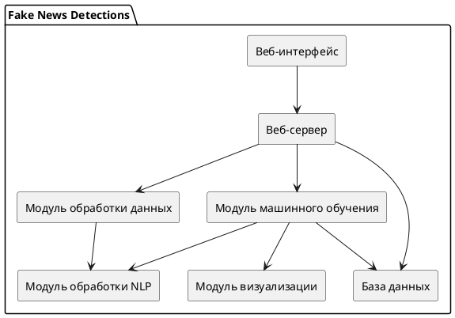

# github_actions


#### Первые шаги в постижении GitHub Actions.
___
Документация по GitHub Actions гласит:
> Автоматизируйте, настраивайте и выполняйте рабочие процессы разработки программного обеспечения прямо в репозитории с помощью GitHub Actions. Вы можете обнаруживать, создавать действия и обмениваться ими для выполнения любой работы, включая CI/CD, а также объединять действия в полностью настраиваемый рабочий процесс.

#### Пример кода .yml
___
```yml
name: Code checks # имя пайплайна

on: # на какие события должен срабатывать этот пайплайн
  push: # срабатывал на push
    branches: [main] # если кто то делает пуш на ветку майн запускался что то
  pull_request: # срабатывал на  pull_request
    branches: [main]

jobs: # здесь те задания которые гит будет выполнять когда выполнятся события сверху
  build: # просто имя джобы
    runs-on: ubuntu-latest # какая машина будет использоваться
    steps:
      - uses: actions/checkout@v3 # скачиваем наш код на машину переход на рабочую область
      - name: Instal python # имя шага
        uses: actions/setup-python@v3 # install py
        with:
          python-version: 3.9
      - name: Instal deps # pip install -r requirements.txt
        run: |
          python -m pip install --upgrade pip
      - name: Run flake8 # приложение для проверки кода на python
        run: flake8 .
      - name: Run mypy
        run: mypy .
```
#### Еще пример
____
```yml
name: Code check

on:
  push:
    branches: [ main ]
  pull_request:
    branches: [ main ]

jobs:
  build:
    runs-on: ubuntu-latest
    steps:
      - uses: actions/checkout@v3
      - name: Install python
        uses: actions/setup-python@v4
        with:
          python-version: 3.9
      - name: Install deps
        run: |
          python - m pip install --upgrade pip
          pip install -r requirements.txt
      - name: Run main.py
        run: |
          python main.py
          python mnist.py
```
#### Полезности
____
- [X] [GitHub Actions](https://docs.github.com/ru/actions)
- [X] [GitHub Actions Введение в CI/CD](https://www.youtube.com/watch?v=e0A2hDObLmg&list=PLaanoSC551cPx2Ao0gMHLW_qkNXy1EVZ8&index=19)
- [X] [GitHub Actions для автоматической проверки кода](https://www.youtube.com/watch?v=NijFSs03Pd4&t=732s)
- [ ] [Основы Git, GitHub и GitHub Actions](https://www.youtube.com/watch?v=DK2PsTcSFFM&list=PLg5SS_4L6LYstwxTEOU05E0URTHnbtA0l)
- [X] [UML для начинающих](https://www.youtube.com/watch?v=0I9aIP5gKCg&list=PLPPIc-4tm3YTw3FUu75jsW4QgrXopfXhX)
- [X] [Что такое UML за 7 минут](https://www.youtube.com/watch?v=REr40AbD7U8)
- [ ] [Полный Пайплайн (Pipeline) || Машинное Обучение](https://www.youtube.com/watch?v=PbLa9DDq-98&t=521s)

#### Ограничения
____
[Git_resource](https://docs.github.com/en/billing/managing-billing-for-github-actions/about-billing-for-github-actions)

#### UML
____
[UML инструмент](https://plantuml.com/ru/)

#### UML EXAMPLE
____
> [Запускать Туть](https://www.plantuml.com/plantuml/uml/SyfFKj2rKt3CoKnELR1Io4ZDoSa70000)


